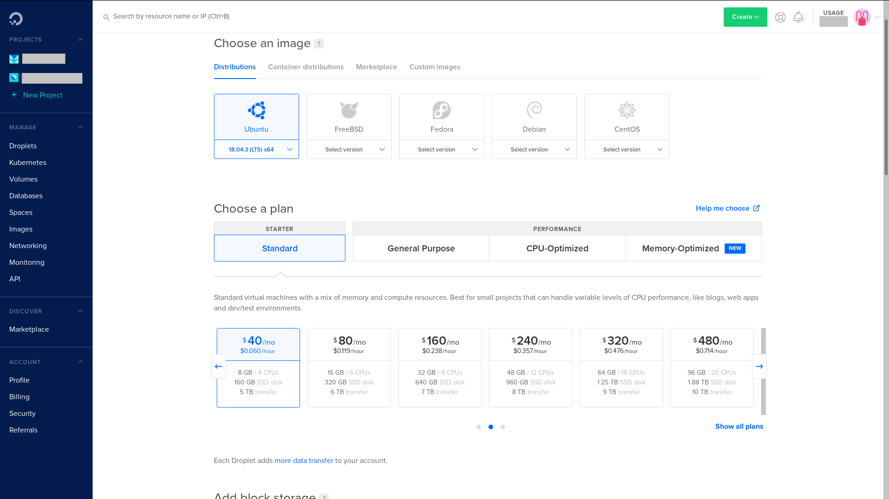
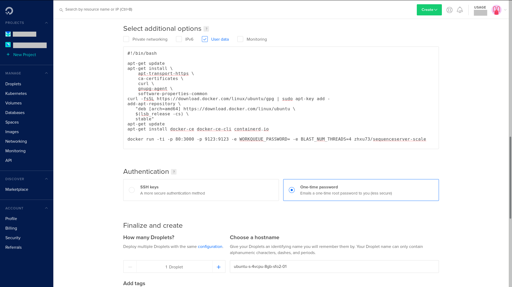
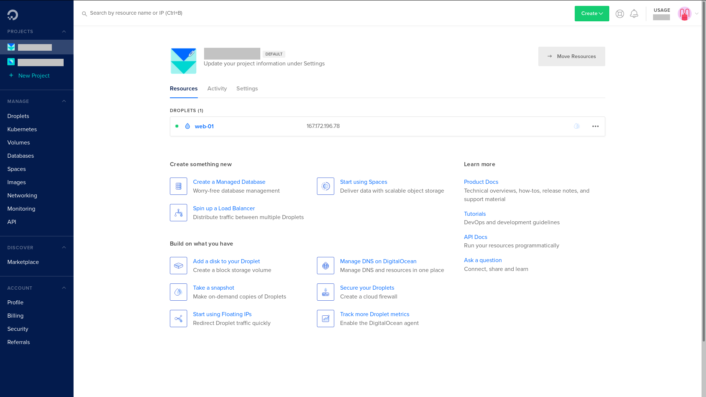
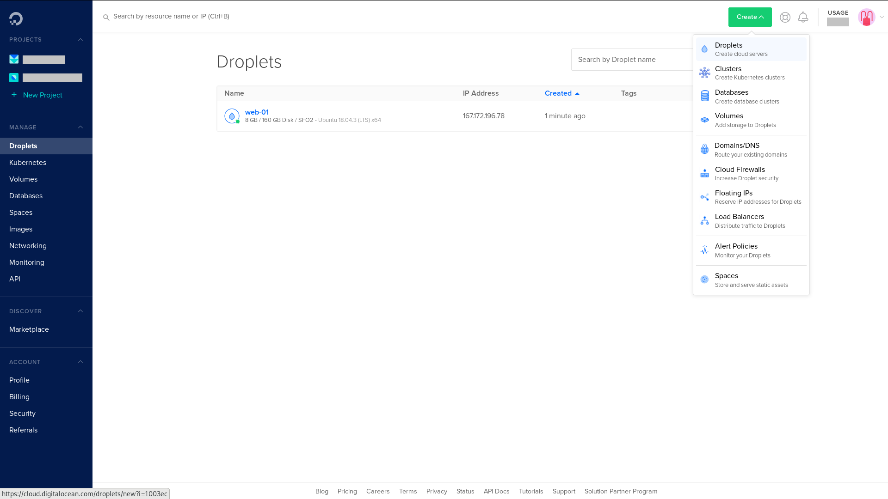
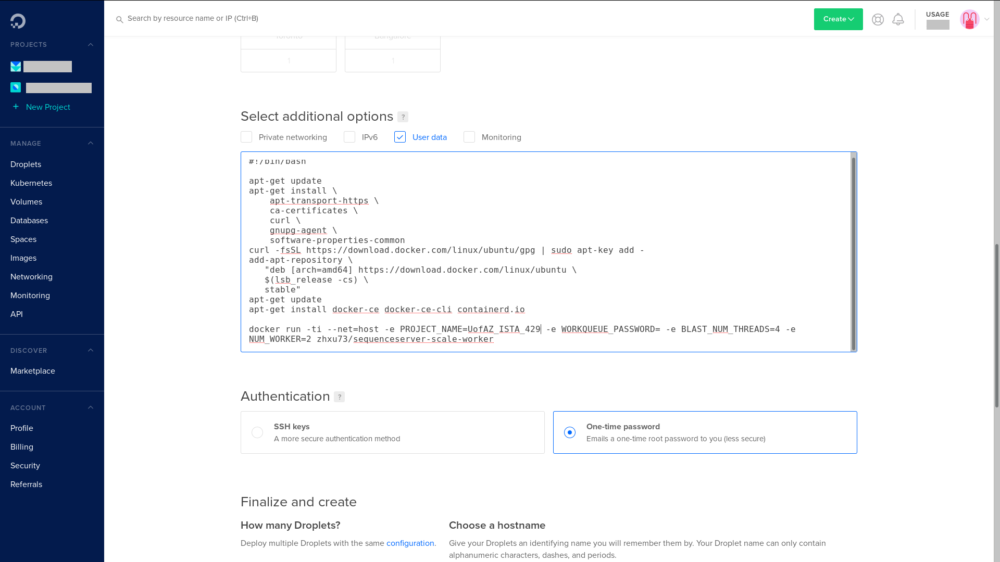

Digital Ocean
~~~~~~~~~~~~~~~~~~~~~~~~~~~~~~~~~~~~~~~~~~~~~~~~~~~~~
1. First create a droplet for the web/master instance
|DO-1|

2. Select droplet type

We recommand a 4 CPU droplet for the master, a standard droplet will be enough

|DO-2|

3. user data (optional)

There are two ways you can launch the docker container, one is with ``user data``, the other way is run the command manually after ssh into the instance.
In the user data, you can paste in the command.

    the script you pass into ``user data`` will be run asynchronously, meaning they might not finish when the droplet shows up as ready, so double

    Note: none of the distribution come with docker installed, and so you need to install it yourself. If you use ``user data`` to run docker container, you will need to paste in command to install docker as well

|DO-6|

4. login method

If you have an ssh key, select the ``SSH keys`` option; if not select the ``One-time password``

|DO-3|

4. Name your droplet to something easily recongnizable, and click ``create``

|DO-4|

5. launch docker container after ssh

If you didn't use ``user data`` to launch docker container, copy the IP address, and go to a terminal, ssh into the droplet.

Install docker, and then launch the docker container

|DO-5|

5. Now create the droplet for workers.

|DO-7|

6. Select droplet type

For the worker droplets, it is recommanded to use General Purpose droplet, if the class size is large, for a more consistent performance.
If your account is new you may not have access to droplets with > 6 CPU, in that case open an ticket to request for access.

|DO-8|

7. user data (optional)

If you wish to run docker via user data
Paste in the command for install Docker_, and command to run worker docker container

|DO-9|

8. Create worker

Name you droplet, and click ``create``

|DO-10|

9. ssh into the worker droplets

Install Docker_
Run worker docker container

10. Repeat the process for creating worker droplet

.. _Docker: https://docs.docker.com/v17.09/engine/installation/linux/docker-ce/ubuntu/#extra-steps-for-aufs

.. |DO-1| image:: ./img/DO-1.png
    :width: 450

.. |DO-4| image:: ./img/DO-4.png
    :width: 450

.. |DO-6| image:: ./img/DO-6.png
    :width: 450

.. |DO-8| image:: ./img/DO-8.png
    :width: 450

.. |DO-10| image:: ./img/DO-10.png
    :width: 450

