******************************************************
StarBLAST-VICE: Web Deployment for Small Classes (<25)
******************************************************

StarBLAST-VICE is a customizable implementation of SequenceServer, deployed as a VICE (Visual and Interactive Computing Environment) web application and hosted on the CyVerse Discovery Environment (DE).
StarBLAST-VICE is launchable with a maximum of 8 CPU cores, 16 GB RAM, and 512 GB disk space.

.. note::

   Before proceeding, a CyVerse account is required. Click `here <https://de.cyverse.org/de/>`_ to register or log in. 

Launching StarBLAST-VICE with Example Databases
===============================================

(1) Click on the following button to launch SequenceServer in CyVerse Discovery Environment with the SWISS-PROT protein database (**requires CyVerse account**). If you are already in the DE, you can navigate to the StarBLAST-VICE app through the Apps button and searching for "StarBLAST-VICE".

|seqserver_QL|_
	
.. note::

   SWISS-PROT is a curated protein sequence database, read more on the `release <https://www.uniprot.org/statistics/Swiss-Prot>`_ or its `orignal publication <https://www.ncbi.nlm.nih.gov/pmc/articles/PMC102476/>`_ 

|DE_running_tut_01|

(2) Choose your own analysis name and the DE output folder. Click "Launch Analysis".

|DE_running_tut_02|

(3) Check the notifications Bell Icon for a link to access your SequenceServer instance. This might take a few minutes. Once the notification shows that the app is running, click on the link. This will open a loading screen in a new tab; Once the app is loaded, you should be able to BLAST through the SequenceServer app.

|DE_running_tut_11|

|DE_running_tut_03|
|DE_running_tut_04|

(4) To test, click `here <https://www.ncbi.nlm.nih.gov/nuccore/NG_007114.1?from=4986&to=6416&report=fasta>`_ for a sample DNA sequence.

(5) Paste the query sequence, select both the available databases and submit job.

Adding Your Own Databases to StarBLAST-VICE
===========================================

To add your own BLAST databases you will need a :code:`.fasta (or .fa, .faa, .fna)`  file containing the reference sequences you'd like to use. These are easily aquirable from NCBI or other databases.

(1) Within the CyVerse DE, click on the "Data" icon. 

(2) Select "Upload" and specify the import from your Desktop or its URL. This will be stored in your personal folder.

|DE_running_tut_05|

(3) Click on the "Apps" icon and use the search bar to find "Create BLAST Database" or click `here <https://de.cyverse.org/de/?type=apps&app-id=decdd668-5616-11e7-9724-008cfa5ae621&system-id=de>`_. As there is a possiblity that there may be multiple apps with the same name, please locate the "Create BLAST Database" developed by developed by Upendra Kumar Devisetty (use the better reviewed one).

|DE_running_tut_06|

(4) Enter a name for your database under "Analysis Name"; this will become your database containing folder. 

   1. "Select output folder" should be your personal folder or any folder of your choice (default will be a foler named "analyses" within your personal folder).

   2. In the "Inputs" tab, select "Browse" and choose the fasta file you uploaded. Select Nucleotide or Protein under "Input Sequence Format". Under "Prefix" choose a name to well reflect your database (e.g. :code:`a_thaliana`).

|DE_running_tut_07|
|DE_running_tut_08|

(5) Click "Launch Analysis" and wait to be notified of its completion. Upon completion, navigate to the output folder specified in step 4.1; Inside you will find a directory with the name you specified in step 4 followed by a timestamp. Within this folder you will find logs and the newly generated database (if nucleotide :code:`.nhr,.nin, .nog, .nsd, .nsi, .nsq` files will be found; if protein, :code:`.phr, .psq` files will be found).

Launching StarBLAST-VICE with Your Own Databases
================================================

To launch StarBLAST-VICE with your own database:

(1) Use the same button for Example Databases, but **do not click "Launch Analysis" just yet**.

(2) In the "Input" tab, select the folder containing your database (if not specified, default is :code:`swissprot-db`).

.. note::

  The user will not be able to see the databases within the folder at this step. Ensure that databases files (as explained in step 4.2 of the previous section) are present beforehand.

(3) Click "Launch Analysis". This might take a few minutes.

Accessing your running Apps
===========================

The notification bell should show your currently running apps and jobs. 

|DE_running_tut_11|

In case you want to see all your jobs and access your running apps (and app history), navigate to the Analyses button.

|DE_running_tut_12|
|DE_running_tut_10|

.. |seqserver_QL| image:: https://de.cyverse.org/Powered-By-CyVerse-blue.svg
.. _seqserver_QL: https://de.cyverse.org/de/?type=quick-launch&quick-launch-id=0ade6455-4876-49cc-9b37-a29129d9558a&app-id=ab404686-ff20-11e9-a09c-008cfa5ae621
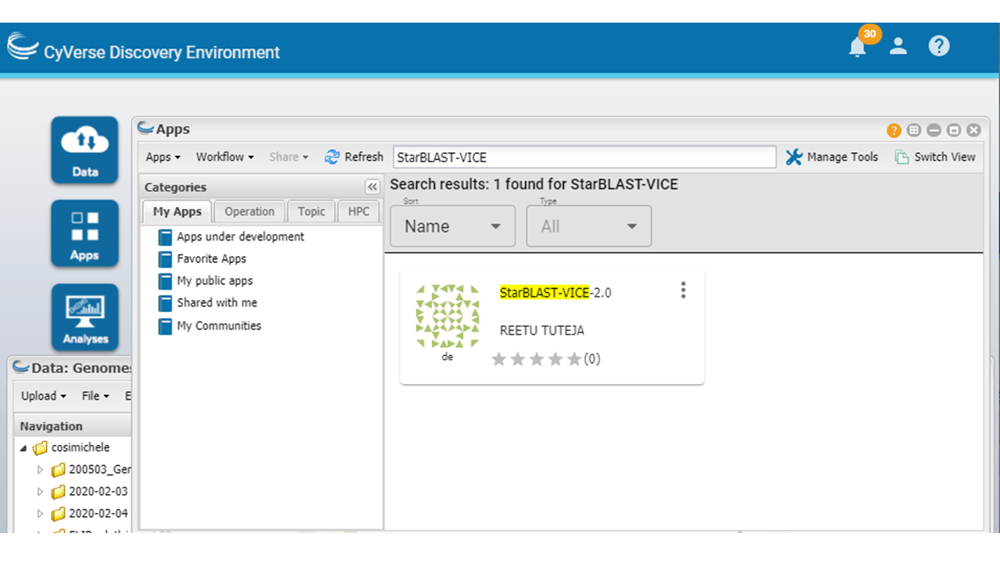
.. _DE_running_tut_01: https://github.com/LyonsLab/StarBLAST/blob/master/docs/img/Tut_png_DE_01.PNG
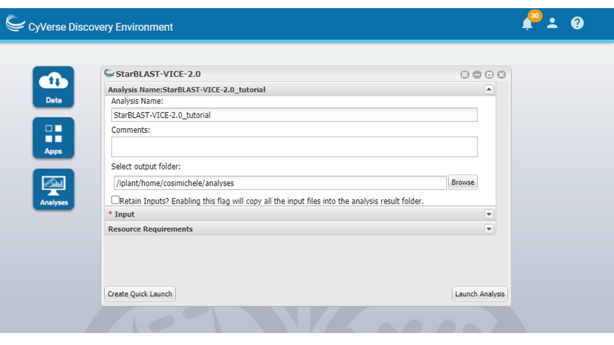
.. _DE_running_tut_02: https://github.com/LyonsLab/StarBLAST/blob/master/docs/img/Tut_png_DE_02.PNG
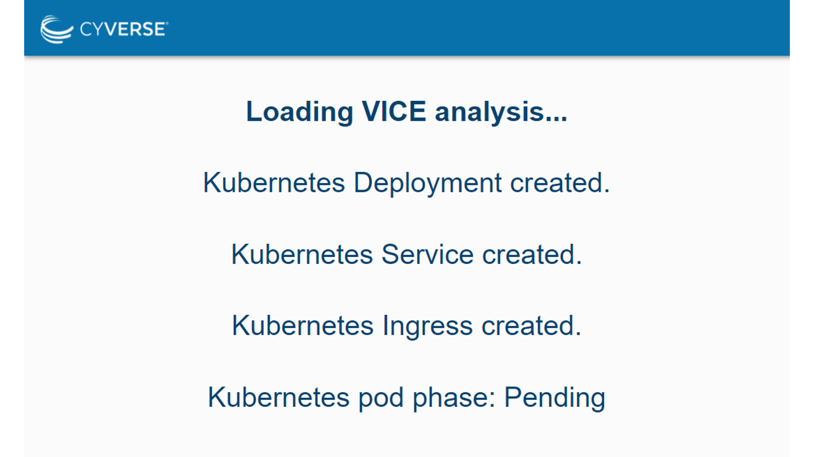
.. _DE_running_tut_03: https://github.com/LyonsLab/StarBLAST/blob/master/docs/img/Tut_png_DE_03.PNG
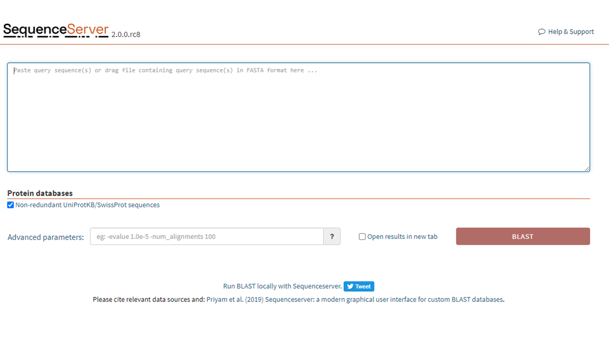
.. _DE_running_tut_04: https://github.com/LyonsLab/StarBLAST/blob/master/docs/img/Tut_png_DE_04.PNG
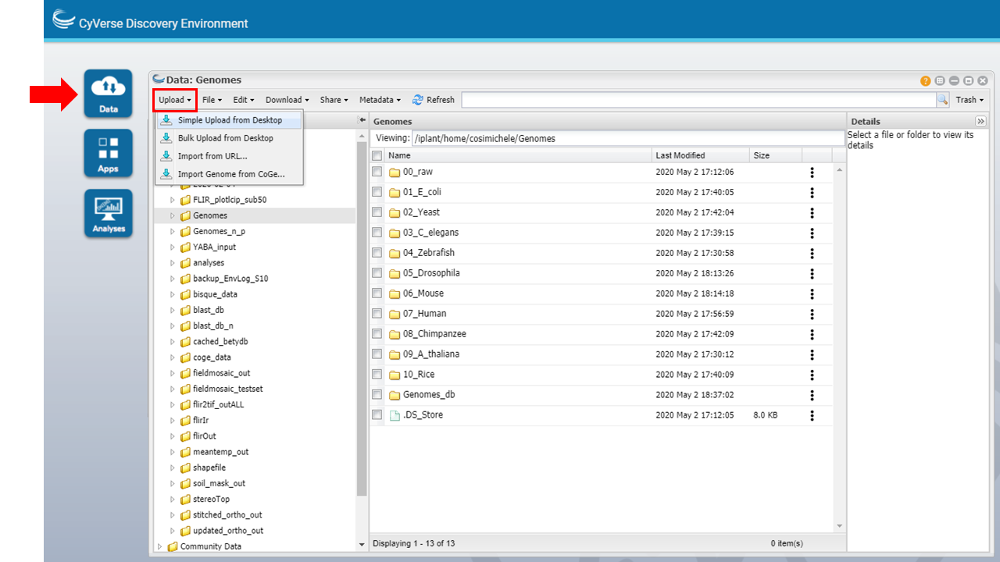
.. _DE_running_tut_05: https://github.com/LyonsLab/StarBLAST/blob/master/docs/img/Tut_png_DE_05.PNG
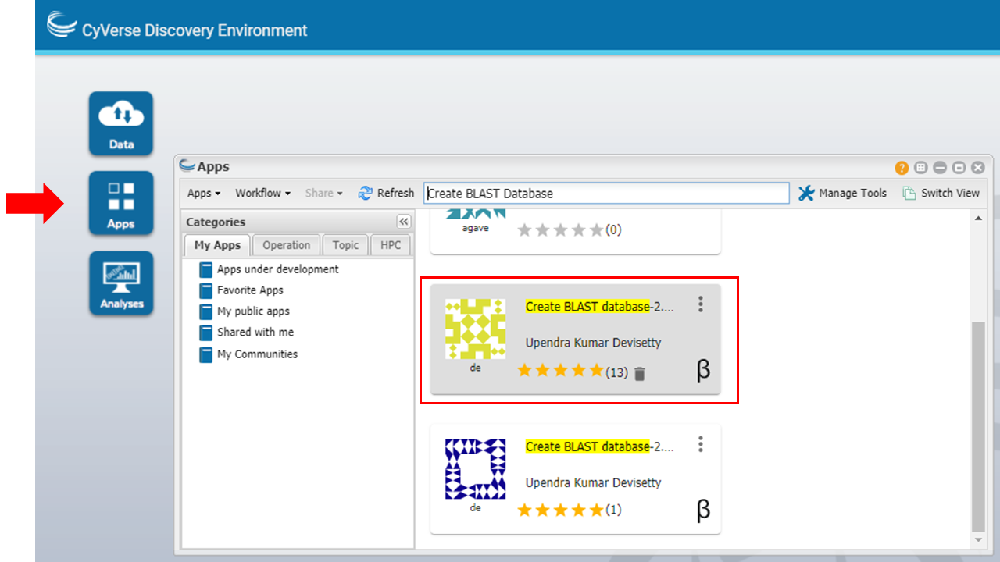
.. _DE_running_tut_06: https://github.com/LyonsLab/StarBLAST/blob/master/docs/img/Tut_png_DE_06.PNG
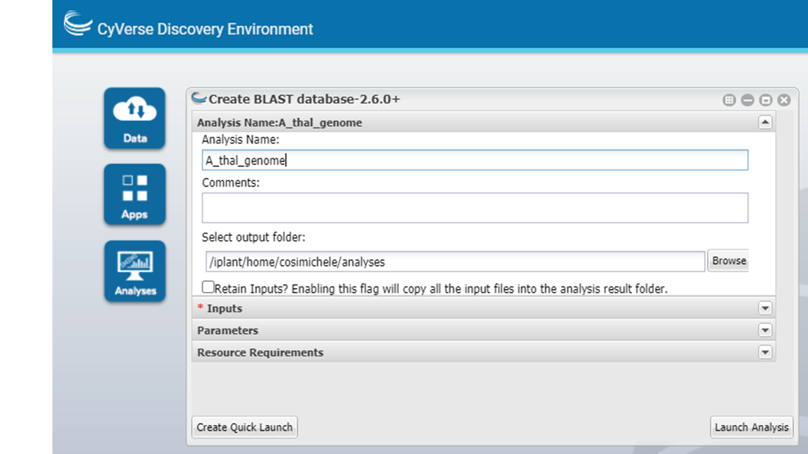
.. _DE_running_tut_07: https://github.com/LyonsLab/StarBLAST/blob/master/docs/img/Tut_png_DE_07.PNG
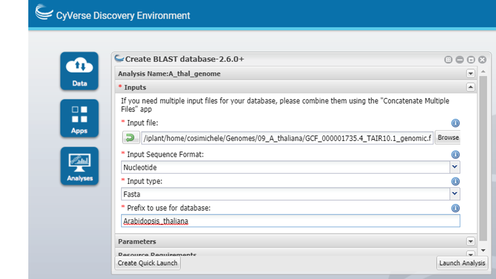
.. _DE_running_tut_08: https://github.com/LyonsLab/StarBLAST/blob/master/docs/img/Tut_png_DE_08.PNG
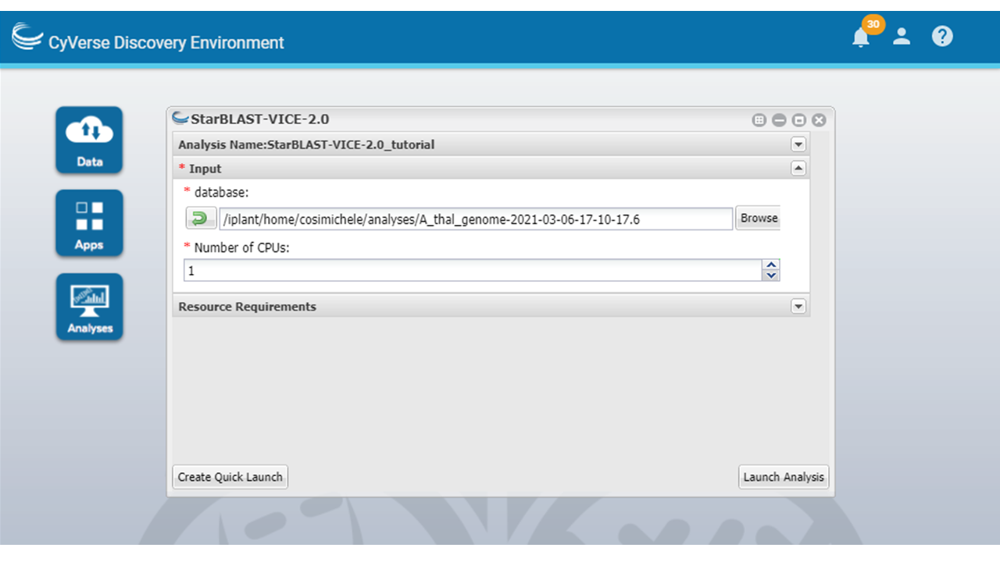
.. _DE_running_tut_09: https://github.com/LyonsLab/StarBLAST/blob/master/docs/img/Tut_png_DE_09.PNG
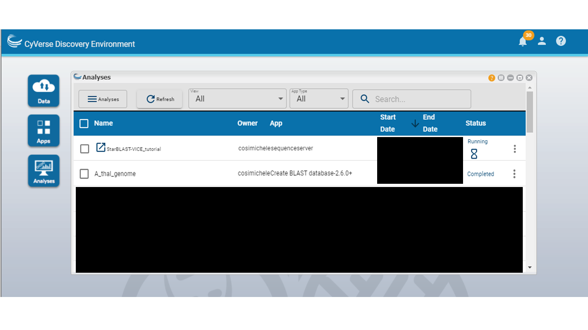
.. _DE_running_tut_10: https://github.com/LyonsLab/StarBLAST/blob/master/docs/img/Tut_png_DE_10.PNG
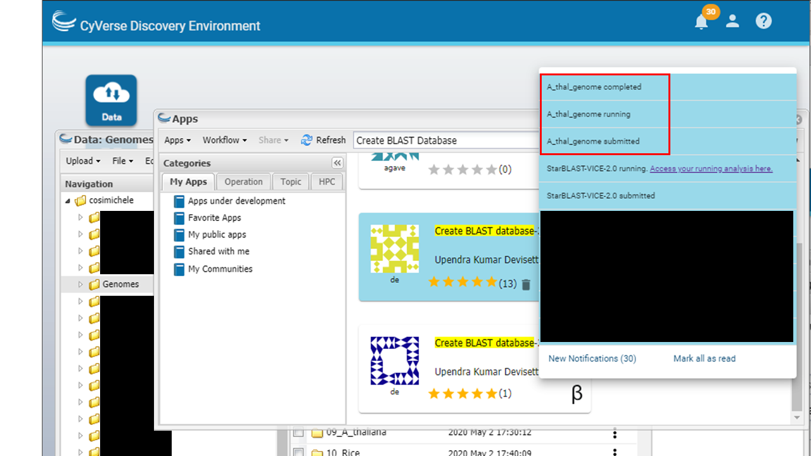
.. _DE_running_tut_11: https://github.com/LyonsLab/StarBLAST/blob/master/docs/img/Tut_png_DE_11.PNG
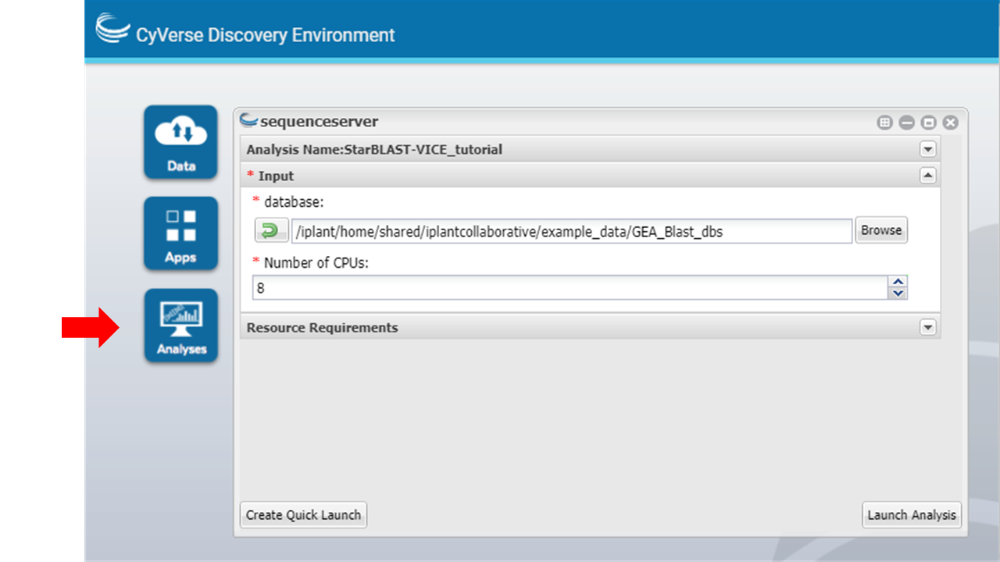
.. _DE_running_tut_12: https://github.com/LyonsLab/StarBLAST/blob/master/docs/img/Tut_png_DE_12.PNG