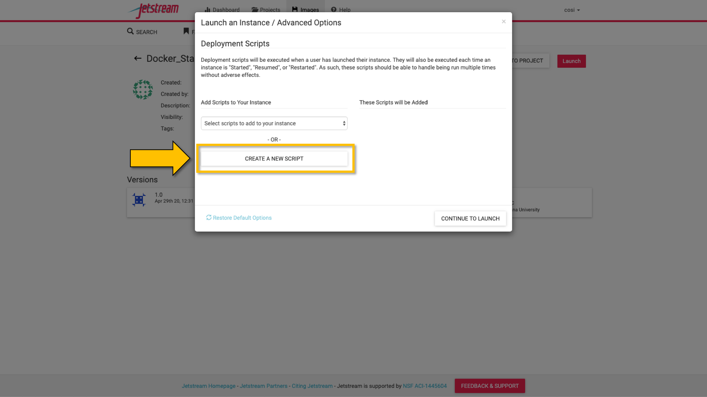
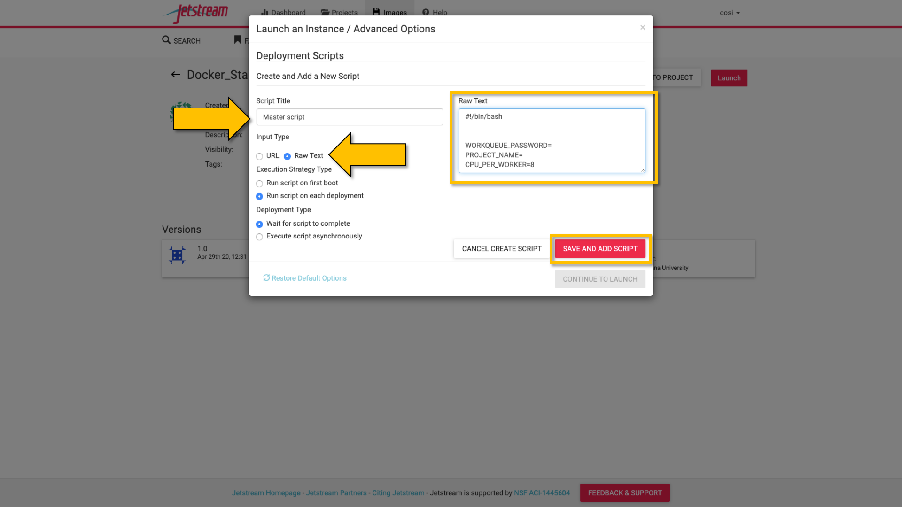

******************************************************
StarBLAST-VICE: Web Deployment for Small Classes (<25)
******************************************************

StarBLAST-VICE is a customizable implementation of SequenceServer, deployed as a VICE (Visual and Interactive Computing Environment) web application and hosted on the CyVerse Discovery Environment (DE).
StarBLAST-VICE is launchable with a maximum of 8 CPU cores, 16 GB RAM, and 512 GB disk space.

.. note::

   Before proceeding, a CyVerse account is required. Click `here <https://de.cyverse.org/de/>`_ to register or log in. 

Launching StarBLAST-VICE with Example Databases
===============================================

**1.** Click on the following button to launch SequenceServer in CyVerse Discovery Environment with two BLAST databases (Human_GRCh38_p12 & Mouse_GRCm38_p4 - **requires CyVerse account**).

	|seqserver_QL|_
	

**2.** Choose your own analysis name and the DE output folder. Click "Launch Analysis".

**3.** Check the notifications Bell Icon for a link to access your SequenceServer instance. This might take a few minutes.

**4.** To test, click `here <https://www.ncbi.nlm.nih.gov/nuccore/NG_007114.1?from=4986&to=6416&report=fasta>`_ for a sample DNA sequence.

**5.** Paste the query sequence, select both the available databases and submit job.

Adding Your Own Databases to StarBLAST-VICE
===========================================

To add your own BLAST databases you will need a :code:`.fasta (or .fa, .faa, .fna)`  file containing the reference sequences you'd like to use. These are easily aquirable from NCBI or other databases.

**1.** Within the CyVerse DE, click on the "Data" icon. 

**2.** Select "Upload" and specify the import from your desktop or its URL. This will be stored in your personal folder.

**3.** Select "File" + "New Folder" to create a folder for your database.

**4.** Click on the "Apps" icon and use the search bar to find "Create BLAST Database" or click `here <https://de.cyverse.org/de/?type=apps&app-id=decdd668-5616-11e7-9724-008cfa5ae621&system-id=de>`_. As there is a possiblity that there may be multiple apps with the same name, please locate the "Create BLAST Database" developed by developed by Upendra Kumar Devisetty.

**5.** Enter a name for your database under "Analysis Name" and choose the new folder you created for the output. In the "Inputs" tab, select "Browse" and choose the fasta file you uploaded.

**6.** Click "Launch Analysis" and wait to be notified of its completion.

Launching StarBLAST-VICE with Your Own Databases
================================================

To launch StarBLAST-VICE with your own database:

**1.** Use the same button for Example Databases, but **do not click "Launch Analysis" just yet**.

**2.** In the "Input" tab, select the folder containing your databse.

**3.** Click "Launch Analysis". This might take a few minutes.

.. |seqserver_QL| image:: https://de.cyverse.org/Powered-By-CyVerse-blue.svg
.. _seqserver_QL: https://de.cyverse.org/de/?type=quick-launch&quick-launch-id=0ade6455-4876-49cc-9b37-a29129d9558a&app-id=ab404686-ff20-11e9-a09c-008cfa5ae621

.. |concept_map| image:: ./img/concept_map.png
    :width: 700
.. _concept_map: 

.. |CyVerse logo| image:: ./img/cyverse_rgb.png
    :width: 700
.. _CyVerse logo: http://learning.cyverse.org/
.. |Home_Icon| image:: ./img/homeicon.png
    :width: 25
.. _Home_Icon: http://learning.cyverse.org/
.. |starblast_logo| image:: ./img/starblast.jpeg
    :width: 700
.. _starblast_logo:   
.. |discovery_enviornment| raw:: html
.. |Tut_0| image:: ./img/JS_03.png
    :width: 700
.. _Tut_0: https://github.com/uacic/StarBlast/tree/master/docs/img/JS_03.png
.. |Tut_0B| image:: ./img/JS_04.png
    :width: 700
.. _Tut_0B: https://github.com/uacic/StarBlast/tree/master/docs/img/JS_04.png
.. |Tut_1| image:: ./img/JS_02.png
    :width: 700
.. _Tut_1: https://github.com/uacic/StarBlast/tree/master/docs/img/JS_02.png
.. |Tut_2| image:: ./img/TJS_05.png
    :width: 700
.. _Tut_2: https://github.com/uacic/StarBlast/tree/master/docs/img/JS_05.png
.. |Tut_3| image:: ./img/JS_06.png
    :width: 700
.. _Tut_3: https://github.com/uacic/StarBlast/tree/master/docs/img/JS_06.png
.. |Tut_4| image:: ./img/JS_07.png
    :width: 700
.. _Tut_4: https://github.com/uacic/StarBlast/tree/master/docs/img/JS_07.png

.. _Tut_5: https://github.com/uacic/StarBlast/tree/master/docs/img/JS_08.png

.. _Tut_6: https://github.com/uacic/StarBlast/tree/master/docs/img/JS_09.png
.. |Tut_7| image:: ./img/JS_10.png
    :width: 700
.. _Tut_7: https://github.com/uacic/StarBlast/tree/master/docs/img/JS_10.png
    <a href="https://de.cyverse.org/de/" target="_blank">Discovery Environment</a>
