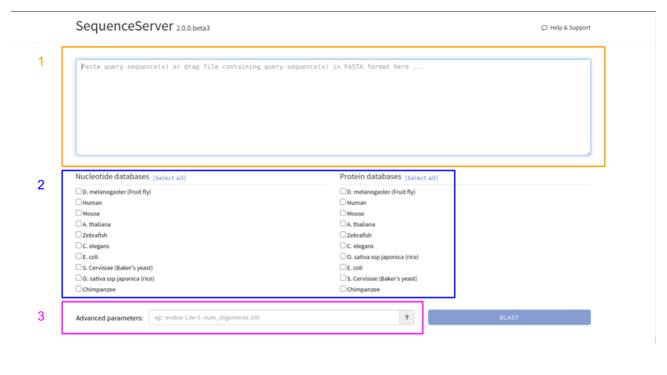

********************
Using SequenceServer
********************

SequenceServer allows to access BLAST+ commands through a simple GUI. Here, we show examples of how to BLAST using SequenceServer. For additional documentation please visit SequenceServer's `official website <https://sequenceserver.com/>`_ and `original publicaiton <https://academic.oup.com/mbe/article/36/12/2922/5549819>`_.

.. note::

   These examples will take into consideration that you already have launched StarBLAST. Visit the other User Guides to know more on launching StarBLAST.

SequenceServer's Main Page
==========================

On the main page, the user will see:
+ (1) the main input box where nucleotide (DNA) or amino acid (protein) sequences can be input using the `FASTA convention <https://blast.ncbi.nlm.nih.gov/Blast.cgi?CMD=Web&PAGE_TYPE=BlastDocs&DOC_TYPE=BlastHelp>`_. 
+ (2) the nucleotide databases (left) and protein databases (right). The user will be able to choose which databases to BLAST against by clicking the boxes left to the databases' names. 
+ (3) the advanced parameters box. A list and description of all the advanced options can be accessed by pressing the "**?**" button. 

.. note::
  
  Advanced Parameters can heavily influence the resulting BLAST results, we suggest to read the descriptions beforehand.

|SB_running_tut_01|_

.. _SB_running_tut_01: https://github.com/uacic/StarBlast/tree/master/docs/img/SB_running_tut_01.png