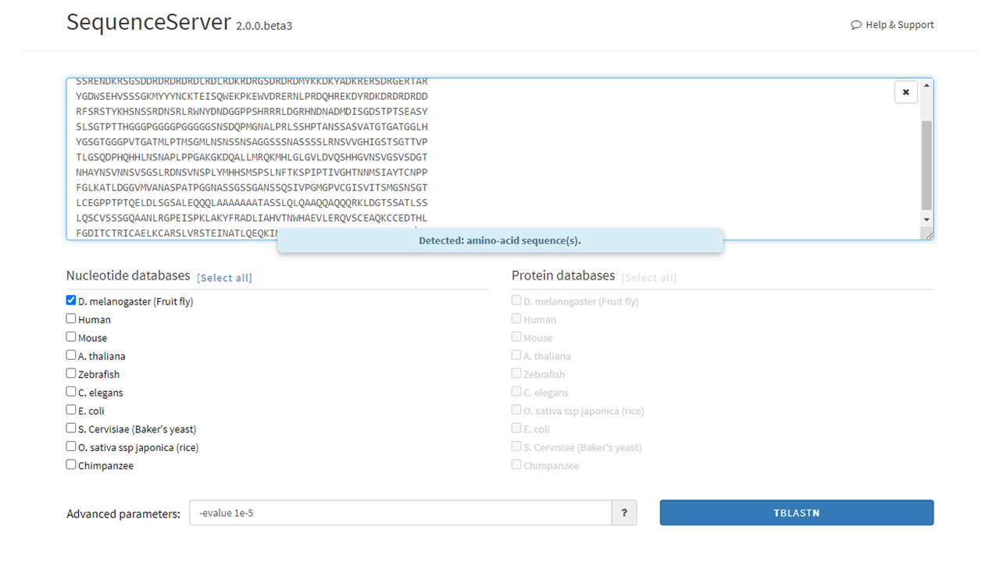
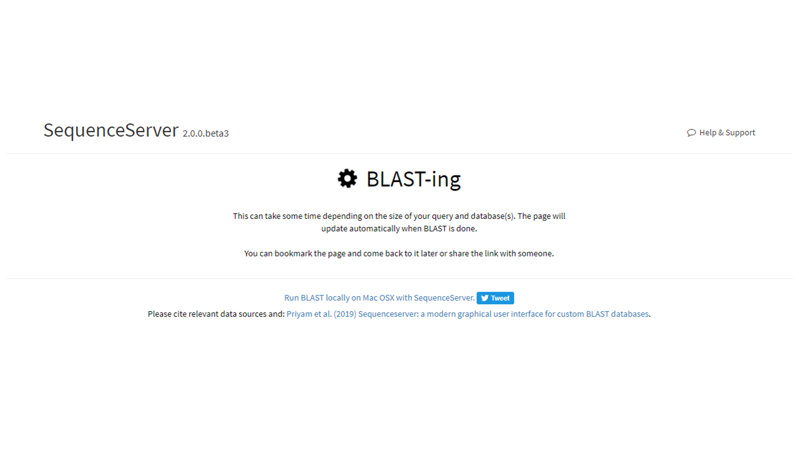
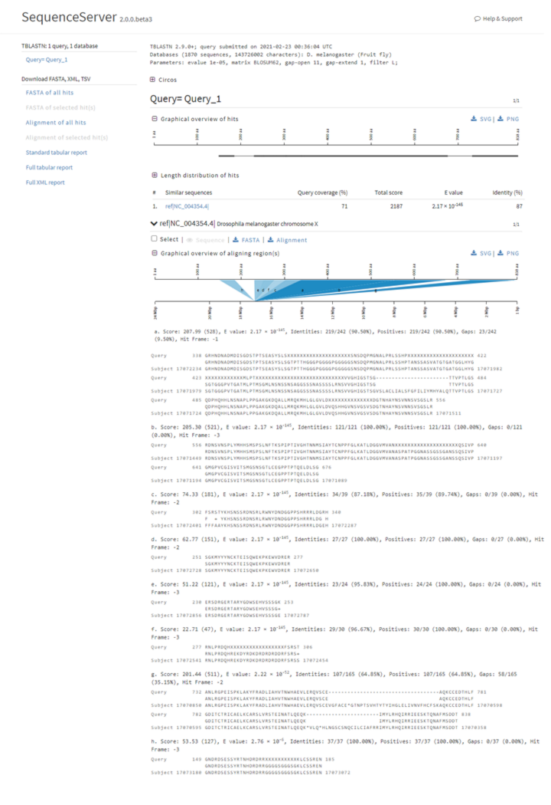
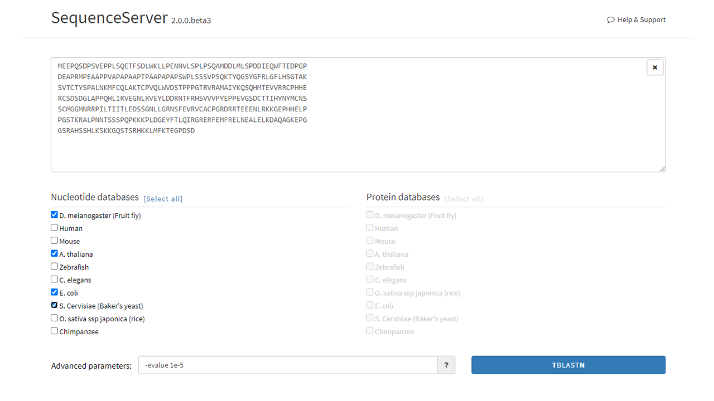
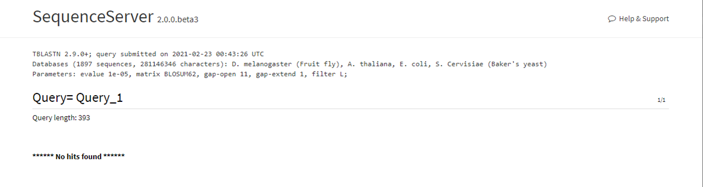

********************
Using SequenceServer
********************

SequenceServer allows to access BLAST+ commands through a simple GUI. Here, we show examples of how to BLAST using SequenceServer. For additional documentation please visit SequenceServer's `official website <https://sequenceserver.com/>`_ and `original publicaiton <https://academic.oup.com/mbe/article/36/12/2922/5549819>`_.

.. note::

   These examples will take into consideration that you already have launched StarBLAST. Visit the other User Guides to know more on launching StarBLAST.

SequenceServer's Main Page
==========================

On the main page, the user will see:

(1) The main input box where nucleotide (DNA) or amino acid (protein) sequences can be input using the `FASTA convention <https://blast.ncbi.nlm.nih.gov/Blast.cgi?CMD=Web&PAGE_TYPE=BlastDocs&DOC_TYPE=BlastHelp>`_. 
(2) The nucleotide databases (left) and protein databases (right). The user will be able to choose which databases to BLAST against by clicking the boxes left to the databases' names. 
(3) The advanced parameters box. A list and description of all the advanced options can be accessed by pressing the "**?**" button. 

.. note::
  
  Advanced Parameters can heavily influence the resulting BLAST results, we suggest to read the descriptions beforehand.

|SB_running_tut_01|_

The input box will recognize the added nucleotide or amino acid sequence. The user can then select the database of choice (this step can be performed before adding the query sequence). 
In the example below, an isoform of the `Wacky protein FASTA sequence <https://www.uniprot.org/uniprot/M9PEY4>`_ was added to the input box and the *Drosophila melanogaster* (*D. melanogaster*) DNA database was selected.

|SB_running_tut_02|_

BLAST Loading & Results Page
============================

After clicking BLAST (in this case TBLASTN), the page will switch to a loading screen. The length of this screen is dependable on:

(1) Computational power of the foreman (BLASTing is done but the machine has difficulties displaying the results due to the number of outputs).
(2) Computational power and availability of workers.
(3) Length of query.

|SB_running_tut_03|_

Here below is the result output of the Wacky BLAST search. This page will display BLAST-related statistical results such as Query coverage (%), Total score, E-value, and Identity for the whole query (top) and specific sequences (below). 
For more information on the BLAST output, visit the `NCBI BLAST FAQ page <https://blast.ncbi.nlm.nih.gov/Blast.cgi?CMD=Web&PAGE_TYPE=BlastDocs&DOC_TYPE=FAQ>`_ or this `Medium article <https://medium.com/computational-biology/how-to-interpret-blast-results-ee304216fd5>`_.

|SB_running_tut_04|_

No-hit Example & Further Reading
================================

Below, we input the protein sequence of the human `p53 gene <https://www.uniprot.org/uniprot/P04637>`_, a well known tumor suppressor. 
Then, we purposefully select non human databases to check for possilble BLAST hits, expecting no results.

|SB_running_tut_05|_

Here is the BLAST results page reporting no resulting BLAST hits, as expected.

|SB_running_tut_06|_

For a more comprehensive and in-depth understanding of BLAST, results and advanced parameters, please refer to the `official NCBI BLAST Handbook <https://www.ncbi.nlm.nih.gov/books/NBK279690/pdf/Bookshelf_NBK279690.pdf>`_.

.. |SB_running_tut_01| image:: ./img/SB_running_tut_01.png
    :width: 700
.. _SB_running_tut_01: https://github.com/uacic/StarBlast/tree/master/docs/img/SB_running_tut_01.png

.. _SB_running_tut_02: https://github.com/uacic/StarBlast/tree/master/docs/img/SB_running_tut_02.png

.. _SB_running_tut_03: https://github.com/uacic/StarBlast/tree/master/docs/img/SB_running_tut_03.png

.. _SB_running_tut_04: https://github.com/uacic/StarBlast/tree/master/docs/img/SB_running_tut_04.png

.. _SB_running_tut_05: https://github.com/uacic/StarBlast/tree/master/docs/img/SB_running_tut_05.png

.. _SB_running_tut_06: https://github.com/uacic/StarBlast/tree/master/docs/img/SB_running_tut_06.png

