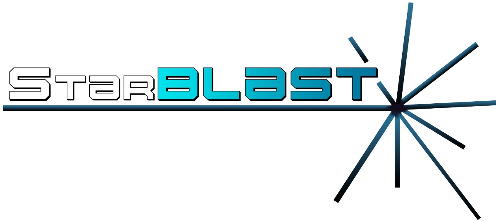
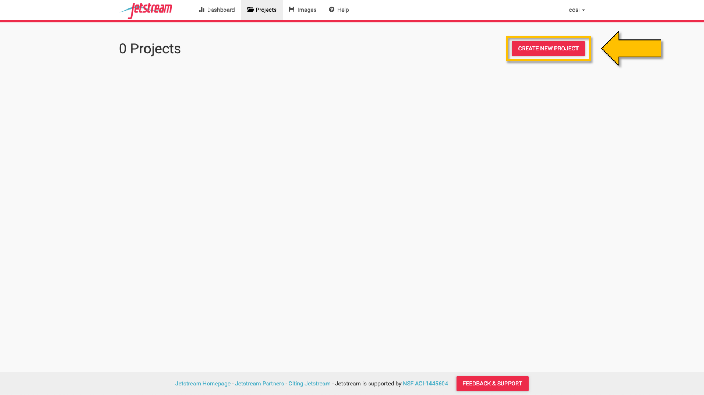

.. StarBLAST documentation master file, created by
   sphinx-quickstart on Thu May 21 12:03:50 2020.
   You can adapt this file completely to your liking, but it should at least
   contain the root `toctree` directive.

*********************
Welcome to StarBLAST!
*********************

|starblast_logo|_

StarBlast is a scalable extension of `SequenceServer <http://sequenceserver.com/>`_ BLAST, making BLAST accessible to educators and researchers running classroom-scale searches concurrently. 

StarBLAST utilizes `cctools <http://ccl.cse.nd.edu/>`_ for faster, distributed computing and CyVerse's Visual Interactive Computing Environment (`VICE <https://learning.cyverse.org/projects/vice/en/latest/getting_started/about.html/>`_).  

What is SequenceServer?
=======================

SequenceServer is a front-end implementation of BLAST with improved GUI and customizable database input developed by the Wurmlab at Queen Mary University of London (`Priyam et al., 2019 <https://doi.org/10.1093/molbev/msz185>`_). However, it is limited in its scaling capabilities and may be difficult to deploy for some people. StarBLAST extends SequenceServer for easier deployment and to scale for a larger number of simultaneous users (e.g., students).

The StarBLAST Suite
===================

Navigate to each implementation for  information on guided deployment:

+ `StarBLAST-VICE: Web Deployment for Small Classes (<25 students) <https://starblast.readthedocs.io/en/latest/2_StarBLAST-VICE.html>`_
+ `StarBLAST-Docker: Cloud Deployment for Medium  Classes (25-100 students) <https://starblast.readthedocs.io/en/latest/3_StarBLAST-Docker.html>`_
+ `StarBLAST-HPC: HPC Deployment for Large Classes (>100 students) <https://starblast.readthedocs.io/en/latest/4_StarBLAST-HPC.html>`_

.. |seqserver_QL| image:: https://de.cyverse.org/Powered-By-CyVerse-blue.svg
.. _seqserver_QL: https://de.cyverse.org/de/?type=quick-launch&quick-launch-id=0ade6455-4876-49cc-9b37-a29129d9558a&app-id=ab404686-ff20-11e9-a09c-008cfa5ae621

.. |concept_map| image:: ./img/concept_map.png
    :width: 700
.. _concept_map: 

.. |CyVerse logo| image:: ./img/cyverse_rgb.png
    :width: 700
.. _CyVerse logo: http://learning.cyverse.org/
.. |Home_Icon| image:: ./img/homeicon.png
    :width: 25
.. _Home_Icon: http://learning.cyverse.org/

.. _starblast_logo:   
.. |discovery_enviornment| raw:: html

Contacts & Issues
=================

If you have questions, suggestions or have encountered a problem, please raise an issue on our `GitHub Issues page <https://github.com/LyonsLab/StarBLAST/issues>`_. 

Official Publication & Citation
===============================

The official publication at the Journal of Open Source Education (JOSE): https://doi.org/10.21105/jose.00102

Cite our work as :code:`Cosi, M., Forstedt, J., Gonzalez, E., Xu, Z., Peri, S., Tuteja, R., Blumberg, K., Campbell, T., Merchant, N. & Lyons E. (2021). StarBLAST: a scalable BLAST+ solution for the classroom. Journal Of Open Source Education, 4(38), 102. doi: 10.21105/jose.00102`
