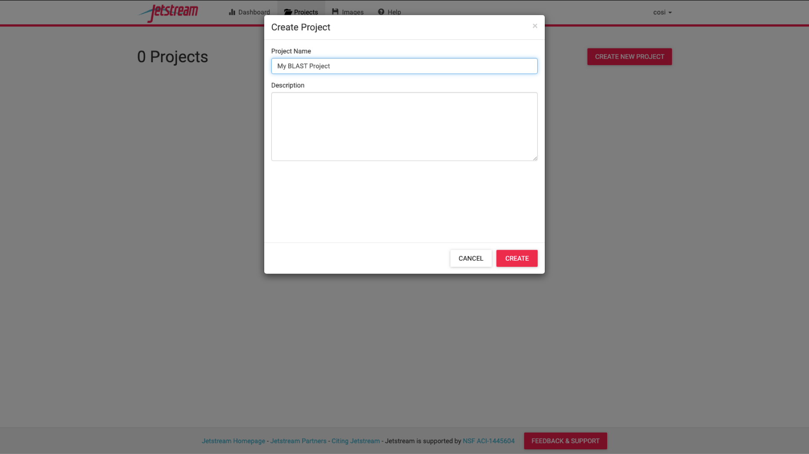
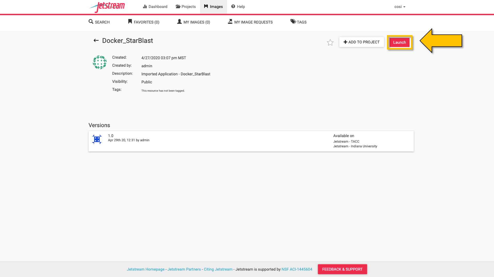
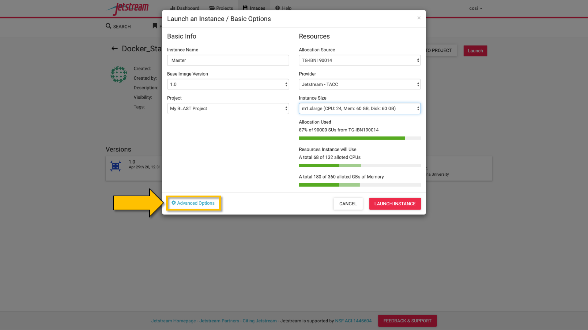
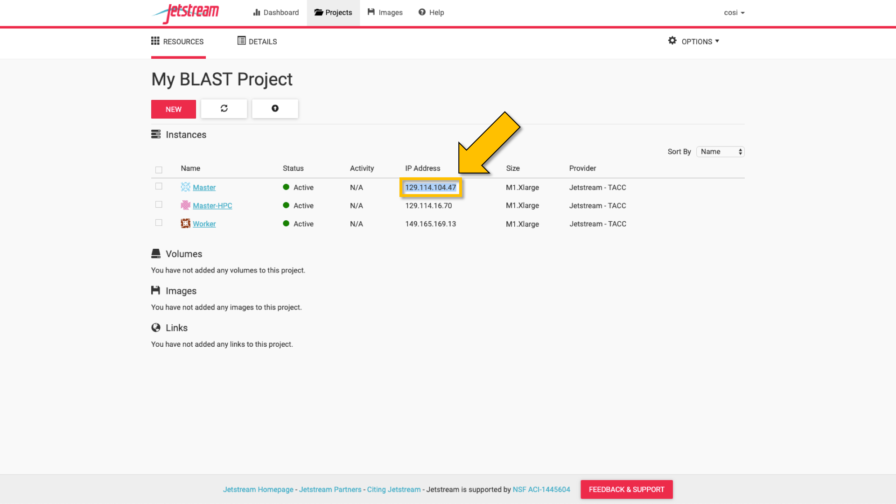

|starblast_logo|_

StarBLAST
=========

StarBLAST is a project undertaken by under-graduate and graduate students taking the "Applied Concepts in Cyberinfrastructure" course, 2019 at the University of Arizona taught by Dr. Nirav Merchant and Dr. Eric Lyons. StarBLAST is a scalable and open source implementation of SequenceServer BLAST. Read on to learn more about StarBLAST.

.. contents::

What is StarBLAST?
------------------

StarBlast is a scalable extension of the open source `SequenceServer <http://sequenceserver.com/>`_ BLAST, with the goal of making BLAST more accessible to educators and researchers who want to run classroom-scale searches concurrently. StarBLAST is distributed scaling of SequenceServer BLAST using `cctools <http://ccl.cse.nd.edu/>`_ and CyVerse's Visual Interactive Computing Environment (`VICE <https://learning.cyverse.org/projects/vice/en/latest/getting_started/about.html/>`_). 

In 2015 a modern front-end implementation of BLAST, SequenceServer, was developed by the Wurmlab at Queen Mary University of London (Priyam et al., 2019). SequenceServer provides various advantages over the NCBI BLAST implementation, such as an improved GUI to visualize BLAST results, the use of custom databases, and the ability to download results in various formats for further analysis. Read about SequenceServer's user-centric design and sustainable software development philosophy `here <https://doi.org/10.1093/molbev/msz185>`_. Despite being a state-of-the-art BLAST service, the current SequenceServer implementation is not easily scalable, especially for classes without IT support or classes with hundreds of students.

StarBLAST extends SequenceServer’s BLAST implementation with the `Work Queue <https://cctools.readthedocs.io/en/latest/work_queue/>`_ job management system and `VICE <https://learning.cyverse.org/projects/vice/en/latest/getting_started/about.html/>`_ to distribute work amongst multiple machines. By providing distributed and scalable BLAST capabilities, StarBLAST enables researchers and instructors to run many BLAST jobs simultaneously using large computational resources. StarBLAST consists of three distinct BLAST implementations that users can select based on their technical expertise, the number of users who want to submit concurrent jobs, and external computational resource availability.

1. StarBLAST-VICE: the primer solution to BLAST limitations
~~~~~~~~~~~~~~~~~~~~~~~~~~~~~~~~~~~~~~~~~~~~~~~~~~~~~~~~~~~~~~

StarBLAST-VICE leverages the University of Arizona’s CyVerse computational infrastructure resources; specifically, the VICE (Visual Interactive and Computing Environment) component of CyVerse’s data science workbench “Discovery Environment (DE)”. VICE allows users to launch web-based applications from the DE and perform exploratory analysis.

StarBLAST-VICE is an entry-level solution that does not need any set-up by instructors and comes with several perks like access to free CyVerse computational resources, ability to share your analysis and create custom BLAST databases. Each student needs to create an account on CyVerse DE to be able to independently launch their own BLAST analysis. This solution is ideal for smaller classrooms with approximately 5–25 students and does not require any command-line expertise for instructors.

2. StarBLAST-Dockers: A secondary, intermediate solution
~~~~~~~~~~~~~~~~~~~~~~~~~~~~~~~~~~~~~~~~~~~~~~~~~~~~~~~~~

StarBlast-Docker makes use of NSF-funded XSEDE's `JetStream <https://use.jetstream-cloud.org/>`_ or other cloud computing resources such as Digital Ocean Cloud, or the Google Cloud Platform. StarBlast-Docker makes use of the Work Queue job management system to create separate “Master” and “Worker” cloud images.

Although this solution requires a bit more setup time than the “VICE” solution, as well as some familiarity with the UNIX command line, it can accommodate larger classrooms of approximately <100 students.

3. StarBLAST-HPC: A robust, tertiary solution
~~~~~~~~~~~~~~~~~~~~~~~~~~~~~~~~~~~~~~~~~~~~~~

Like the intermediate solution, the heaviest StarBLAST-HPC solution makes use of a “Master-Worker” set up in which a dockerized cloud environment virtual machine image serves as the “Master” computer. In contrast to the Docker on a cloud solution, the “Worker” computers are sourced from High-Performance Computer (HPC) systems.

This solution allows a great deal of scalability, enabling classrooms of >100 or more students to run concurrent jobs.

Platform(s)
-----------

*We will use the following CyVerse platform(s):*

.. list-table::
    :header-rows: 1

    * - Solution
      - Platform
      - Capacity
      - Link
      - Platform Documentation
      - Learning Center Docs
    * - StarBLAST-VICE
      - Discovery Environment
      - 5-25 Students
      - `Discovery Environment <https://de.cyverse.org/de/>`_
      - `DE Manual <https://cyverse.atlassian.net/wiki/spaces/DEmanual/overview>`_
      - `Guide <https://learning.cyverse.org/projects/discovery-environment-guide/en/latest/>`__
    * - StarBLAST-Docker on JetStream Cloud
      - JetStream Cloud / Docker
      - <100 Students
      - `JetStream <https://use.jetstream-cloud.org/>`_
      - `JetStream Manual & Guide <https://portal.xsede.org/jetstream>`_
    * - StarBLAST-HPC
      - HPC & JetStream Cloud
      - >100 Students
      - `cctools <https:://github.com/cooperative-computing-lab/>`_
      - `PBS on HPC  <https://public.confluence.arizona.edu/display/UAHPC>`_
      - `Workqueue <https://cctools.readthedocs.io/en/latest/work_queue/>`__

----

StarBLAST-VICE Setup
--------------------

StarBLAST-VICE is a Visual and Interactive Computing Environment app in CyVerse’s Discovery Environment (DE) for running interactive apps such as SequenceServer. 

.. note::

   Requires access to Cyverse `Discovery Environment <https://de.cyverse.org/de/>`_

Quick Launch
~~~~~~~~~~~~

1. Click on the following button to quick-launch SequenceServer in CyVerse Discovery Environment with two blast databases (Human_GRCh38_p12 & Mouse_GRCm38_p4).

	|seqserver_QL|_
	
2. Click [Launch Analysis]
3. Check the notifications Bell Icon for a link to access your SequenceServer instance.
4. Click `here <https://www.ncbi.nlm.nih.gov/nuccore/NG_007114.1?from=4986&to=6416&report=fasta>`_ for a sample DNA sequence to test the sequence similarity of the query fragment with random human and mouse sequences.
5. Paste the query sequence and select both the available databases and submit job.

.. note::
   To set up your own custom database on the VICE platform, see the appendix section.

----

StarBLAST-Dockers Setup on JetStream Cloud 
--------------------------------------------

To deploy StarBLAST setup on the JetStream Cloud service, you will need access to `JetStream <https://use.jetstream-cloud.org/>`_. To log on JetStream you need to have either a `Globus <https://www.globus.org/>`_ account, an `XSEDE <https://portal.xsede.org/my-xsede#/guest>`_ account or for your institution to have access to XSEDE (you can check this by searching for your institution name from the drop down menu in JetStream's login page).

.. note::
   The StarBlast implementation consists of one Master instance that will serve as the front-end for all users and one or more Worker instances that connect to the master and execute the BLAST jobs.

You will need to launch a Master instance that will host sequenceServer front-end and one or more Worker instances as needed to distribute the BLAST jobs. 

Both the Master and Worker Virtual Machine instances use Docker containers to run SequenceServer and connect Workers. 

Launching Master & Worker Instances
~~~~~~~~~~~~~~~~~~~~~~~~~~~~~~~~~~~

1. Login to `JetStream Cloud <https://use.jetstream-cloud.org/>`_ where we will be setting up Master and Worker instances that are to be launched using the following respective deployment scripts. These deployment scripts (Master & Worker) are designed to:
	+ download specified BLAST databases
	+ Master script to launch sequenceServer front-end that can be accessed using the IP ADDRESS of the instance. 
	+ Worker script to connect factory of workers to the Master

2. The deployment scripts for a Master instance (atmo_deploy_master.sh) can be found `here <https://raw.githubusercontent.com/zhxu73/sequenceserver-scale-docker/master/deploy/iRODS/Jetstream_deploy_master.sh>`_. 

3. The deployment scripts for a Worker instance (atmo_deploy_worker.sh) can be found `here <https://raw.githubusercontent.com/zhxu73/sequenceserver-scale-docker/master/deploy/iRODS/Jetstream_deploy_worker.sh>`_.

.. note::
   Users can specify the BLAST databases to be downloaded in the deployment scripts 

4. Launching Master instance with deployment script

- From `JetStream's <https://use.jetstream-cloud.org/application/dashboard>`_ top menu, navigate to "Projects" and select "Create New Project".

|Tut_0|_

- In the "Project Name" field, name your project and add a description if needed.

|Tut_0B|_

- From `JetStream's <https://use.jetstream-cloud.org/application/dashboard>`_ dashboard, select “Launch New Instance”.

|Tut_1|_
  
- Search for “Docker_starBLAST” and select the “Docker_starBLAST” image (or click `here <https://use.jetstream-cloud.org/application/images/967>`_); click “Launch”

|Tut_2|_

|Tut_3|_ 

- In the pop up menu you can customize your image (e.g. Instance Size. recommend a minimum of m1.xlarge instance for Master, with at least 60GB disk space); select “Advanced Options”.

|Tut_4|_

-  Select “Create a New Script”. 

|Tut_5|_

-  Title the script according to Master (e.g. Master script) or Worker (e.g. Worker script) depending  on wether you're deploying the Master or Worker; Select “Raw Text” and copy and paste text from either the Master (if creating the Master virtual machine) or Worker (if creating the Worker virtual machine) deployment scripts linked above. Select “Save and Add Script” and then "Continue to Launch".

.. note::
   This step is required to be done **once** for the Master and **once for every Worker virtual machine**. The deployment scripts are stored in user's advanced settings and will be available readily for future use.
 
|Tut_6|_

5. Repeat for one or more Worker instance(s) with the Worker deployment script as per the steps above. Strongly recommended to use large or extra large images (at least 60GB of disk space is required).

.. note::
   JetStream cloud will take around 10-20 minutes to set up and activate your customized virtual machines and the wait-time will increase with the size of the BLAST database.
  
Start Blasting
~~~~~~~~~~~~~~

Now, anyone can open a web-browser and go to <MASTER_VM_IP_ADDRESS> to access sequence-Server front-end and start BLASTING!

|Tut_7|_

.. code::

   <MASTER_VM_IP_ADDRESS>

----

StarBLAST-HPC Setup
-------------------

The StarBLAST-HPC Setup is ideal for distributing BLAST searches across multiple nodes on a High-Performance Computer.

In order to achieve a successful setup of the StarBLAST HPC system, a moderate amount of command line knowledge is required.

Similar to the StarBLAST-Dockers on Atmosphere cloud, the StarBLAST-HPC system also has a Master-Worker set-up: an atmosphere VM machine acts as the Master, and the HPC acts as the Worker. It is suggested that the Worker is set up well ahead of time.

Setting Up the Worker HPC
~~~~~~~~~~~~~~~~~~~~~~~~

It is important that the following software are installed on the HPC:

- glibc version 2.14 or newer, 

- ncbi-blast+ version 2.6.0 or newer (ftp://ftp.ncbi.nlm.nih.gov/blast/executables/blast+/LATEST/ncbi-blast-2.9.0+-src.tar.gz)

- CCTools version 7.0.21 or newer (https://ccl.cse.nd.edu/software/files/cctools-7.1.5-source.tar.gz).

Make both ncbi-blast+ and CCTools available in your home directory; to find out your home directory do

.. code::

   pwd
   
Your home directory should be something similar to

.. code::

   /home/<U_NUMBER>/<USER>/
   
Download the software (BLAST+ and CCTools), un-tar,and add to path using

.. code::

   wget <BLAST_URL or CCTOOLS_URL>
   tar -xvf <BLAST_repo.tar.gz or CCTOOLS_repo.tar.gz>
   export PATH=$HOME</PATH/TO/BLAST/BIN/>:$PATH
   
.. note::

   CCTools only works with glibc version 2.14 or newer, confirm that your HPC has glibc version 2.14 or newer is installed or avaialbe to load (check module load or avaialable documentation). In the following examples, we assume that both glibc and BLAST+ are avaiable to be loaded through `module load`.

BLAST databases need to be downloaded in a <DATABASE> directory in the home folder.

.. code::

   /home/<U_NUMBER>/<USER>/<DATABASE>
   
The HPC uses a .pbs and qsub system to submit jobs.

Create a .pbs file that contains the following code and change the <VARIABLES> to preferred options:

.. code::

   #!/bin/bash
   #PBS -W group_list=<GROUP_LIST>
   #PBS -q windfall
   #PBS -l select=<N_OF_NODES>:ncpus=<N_OF_CPUS>:mem=<N_MEMORY>gb
   #PBS -l place=pack:shared
   #PBS -l walltime=<MAX_TIME>
   #PBS -l cput=<MAX_TIME>
   module load blast
   module load unsupported
   module load ferng/glibc
   module load singularity
   export CCTOOLS_HOME=/home/<U_NUMBER>/<USER>/<CCTOOLS_DIRECTORY>
   export PATH=${CCTOOLS_HOME}/bin:$PATH

   cd /home/<U_NUMBER>/<USER>/<WORKERS_DIRECTORY>

   MASTER_IP=<MASTER_IP>
   MASTER_PORT=<PORT_NUMBER>
   TIME_OUT_TIME=<TIME_OUT_TIME>
   PROJECT_NAME=<PROJECT_NAME>

   /home/<U_NUMBER>/<USER>/<CCTOOLS_DIRECTORY>/bin/work_queue_factory -T local -M $PROJECT_NAME --cores <N_CORES> -w <MIN_N_WORKERS> -W <MAX_N_WORKERS> -t $TIME_OUT_TIME

An example of a .pbs file running on the University of Arizona HPC:

.. code::

   #!/bin/bash
   #PBS -W group_list=lyons-lab
   #PBS -q windfall
   #PBS -l select=2:ncpus=12:mem=24gb
   #PBS -l place=pack:shared
   #PBS -l walltime=02:00:00
   #PBS -l cput=02:00:00
   module load blast
   module load unsupported
   module load ferng/glibc
   module load singularity
   export CCTOOLS_HOME=/home/u12/cosi/cctools-7.0.19-x86_64-centos7
   export PATH=${CCTOOLS_HOME}/bin:$PATH

   cd /home/u12/cosi/cosi-workers

   MASTER_IP=128.196.142.13
   MASTER_PORT=9123
   TIME_OUT_TIME=1800
   PROJECT_NAME="starBLAST"

   /home/u12/cosi/cctools-7.0.19-x86_64-centos7/bin/work_queue_factory -T local -M $PROJECT_NAME --cores 12 -w 1 -W 8 -t $TIME_OUT_TIME

In the example above, the user already has blast installed (calls it using “module load blast“). The script will submit to the HPC nodes a minimum of 1 and a maximum of 8 workers per node.

Submit the .pbs script with 

.. code::
    
   qsub <NAME_OF_PBS>.pbs
   
Setting Up Master VM for starBLAST-HPC
~~~~~~~~~~~~~~~~~~~~~~~~~~~~~~~~~~~~~~~~~~

The Master VM for StarBLAST-HPC is set up similarly to how the Master for starBLAST-Docker is set up, with the difference that the Master for starBLAST-HPC **does not require the deployment script**. Therefore, in order to set up the Master for starBLAST-HPC, follow the same steps as above _without_ adding the Master deployment script. Additionally, BLAST databases need to be loaded manually onto the <DATABASE> folder.

Once the VM is ready, either access it through ssh or by using the Web Shell ("Open Web Shell" button on your VM's page). Once inside follow the next steps.

.. note::

   **IMPORTANT: THE PATH TO THE DATABASE ON THE MASTER NEED TO BE THE SAME AS THE ONE ON THE WORKER**

To ensure both the databases on the Master VM and Worker HPC are in the same directory, on the Worker HPC go to the <DATABASE> directory and do

.. code::

   pwd
   
Then, on your Master VM, create the directory with the same path as above

.. code::

   mkdir -p SAME/PATH/TO/HPC/DATABASE/DIRECTORY/

Now you have set up the <DATABASE> directories but you still need the databases. Databases can be parsed manually through BLAST+'s `makeblastdb` if you have your own .fasta (or .faa, .fna) files or you can use the same databases as StarBLAST-Docker. In order to use the latter, you need to have iRODS installed (JetStream comes with iRODS pre-installed) and a CyVerse account. Then, do:

.. code::

   iinit

It will ask for certain credentials, connect to the CyVerse with:

.. code::

   host name (DNS): data.cyverse.org
   port #: 1247
   username: <CyVerse_ID>
   zone: iplant
   password: <CyVerse_password>

If successful, obtain the databases and move them to your <DATABASE> folder:

.. code::

   iget -rKVP /iplant/home/cosimichele/200503_Genomes_n_p
   mv GCF_* /DATABASE/DIRECTORY/
   
Then move the databases to the HPC through either `sftp` or follow the same steps as above if your HPC system has access to iRODS.

Copy and paste the following code in the Master instance to launch sequenceServer.

.. code:: 

   docker run --rm --name sequenceserver-scale -p 80:3000 -p 9123:9123 -e PROJECT_NAME=<PROJECT_NAME> -e WORKQUEUE_PASSWORD=<PASSWORD> -e BLAST_NUM_THREADS=<N THREADS> -e SEQSERVER_DB_PATH="/home/<U_NUMBER>/<USER>/<DATABASE_DIRECTORY>" -v /DATABASE/ON/MASTER:/DATABASE/ON/WORKER zhxu73/sequenceserver-scale:no-irods
   
An example is:

.. code:: 

   docker run --rm --name sequenceserver-scale -p 80:3000 -p 9123:9123 -e PROJECT_NAME=starBLAST -e WORKQUEUE_PASSWORD= -e BLAST_NUM_THREADS=2 -e SEQSERVER_DB_PATH="/home/u12/cosi/DATABASE" -v /home/u12/cosi/DATABASE:/home/u12/cosi/DATABASE zhxu73/sequenceserver-scale:no-irods
   
.. note::

   The custom Database folder on the Master needs to have read and write permissions
   
Start BLASTING! Enter the <MASTER_VM_IP_ADDRESS> in your browser using the actual Master IP address.

.. code::

   <MASTER_VM_IP_ADDRESS>
   
----

Appendix
--------

SequenceServer-VICE Using Custom Databases
~~~~~~~~~~~~~~~~~~~~~~~~~~~~~~~~~~~~~~~~~~

See documentation and a demo tutorial on launching the SequenceServer VICE app with custom databases `here <https://cyverse-sequenceserver.readthedocs-hosted.com/en/latest/>`_.

StarBLAST concept map
~~~~~~~~~~~~~~~~~~~~~

|concept_map|_

StarBLAST Using iRods for Custom Databases
~~~~~~~~~~~~~~~~~~~~~~~~~~~~~~~~~~~~~~~~~~

Set the PATH to custom databases on CyVerse Data Store by using the custom IRODS_SYNC_PATH variable 

.. code:: 
   
   -e IRODS_SYNC_PATH=/PATH/TO/Databases

StarBLAST-Docker on any Cloud Using Custom Databases
~~~~~~~~~~~~~~~~~~~~~~~~~~~~~~~~~~~~~~~~~~~~~~~~~~~~

StarBLAST (no-irods) docker containers can be run on any cloud platform/s you have access to by supplying the local path to blast databases as follows:

Master/Web Docker

.. code::
   
   docker run -ti -p 80:3000 -p 9123:9123 -e PROJECT_NAME=StarBLAST -e WORKQUEUE_PASSWORD= -e BLAST_NUM_THREADS=4 --volume=/local_db_path:/var/www/sequenceserver/db zhxu73/sequenceserver-scale:no-irods

Worker Docker

.. code::

   docker run -ti --net=host -e PROJECT_NAME=StarBLAST -e WORKQUEUE_PASSWORD= -e BLAST_NUM_THREADS=4 -e NUM_WORKER=2 --volume=/local_db_path:/var/www/sequenceserver/db zhxu73/sequenceserver-scale-worker:no-irods
   
.. note::

   Here are some links to private and public cloud service providers:
   
   `XSEDE Jetstream <https://use.jetstream-cloud.org/application/images>`_
   
   `Digital Ocean Cloud <https://www.digitalocean.com/>`_. See more documentation `here <DO.rst>`_.
   
   `Google Cloud Platform <https://cloud.google.com/>`_

Making Custom Databases using ncbi_blast_docker
~~~~~~~~~~~~~~~~~~~~~~~~~~~~~~~~~~~~~~~~~~~~~~~~

	+ Read more here at `ncbi docker wiki <https://github.com/ncbi/docker/wiki/Getting-BLAST-databases>`_

----

Acknowledgements
~~~~~~~~~~~~~~~~

+ Anurag Priyam, Ben J Woodcroft, Vivek Rai, Ismail Moghul, Alekhya Munagala, Filip Ter, Hiten Chowdhary, Iwo Pieniak, Lawrence J Maynard, Mark Anthony Gibbins, HongKee Moon, Austin Davis-Richardson, Mahmut Uludag, Nathan S Watson-Haigh, Richard Challis, Hiroyuki Nakamura, Emeline Favreau, Esteban A Gómez, Tomás Pluskal, Guy Leonard, Wolfgang Rumpf, Yannick Wurm, Sequenceserver: A Modern Graphical User Interface for Custom BLAST Databases, Molecular Biology and Evolution, Volume 36, Issue 12, December 2019, Pages 2922–2924, https://doi.org/10.1093/molbev/msz185.

----

**Fix or improve this documentation**

- On Github: `Repo link <https://github.com/uacic/StarBlast>`_
- Send feedback: `Maintainer@StarBLAST <sateeshp@email.arizona.edu>`_

----

.. |seqserver_QL| image:: https://de.cyverse.org/Powered-By-CyVerse-blue.svg
.. _seqserver_QL: https://de.cyverse.org/de/?type=quick-launch&quick-launch-id=0ade6455-4876-49cc-9b37-a29129d9558a&app-id=ab404686-ff20-11e9-a09c-008cfa5ae621

.. |concept_map| image:: ./img/concept_map.png
    :width: 700
.. _concept_map: 

.. |CyVerse logo| image:: ./img/cyverse_rgb.png
    :width: 700
.. _CyVerse logo: http://learning.cyverse.org/
.. |Home_Icon| image:: ./img/homeicon.png
    :width: 25
.. _Home_Icon: http://learning.cyverse.org/
.. |starblast_logo| image:: ./img/starblast.jpeg
    :width: 700
.. _starblast_logo:   
.. |discovery_enviornment| raw:: html
.. |Tut_0| image:: ./img/JS_03.png
    :width: 700
.. _Tut_0: https://raw.githubusercontent.com/uacic/StarBlast/master/img/JS_03.png

.. _Tut_0B: https://raw.githubusercontent.com/uacic/StarBlast/master/img/JS_04.png
.. |Tut_1| image:: ./img/JS_02.png
    :width: 700
.. _Tut_1: https://raw.githubusercontent.com/uacic/StarBlast/master/img/JS_02.png
.. |Tut_2| image:: ./img/TJS_05.png
    :width: 700
.. _Tut_2: https://raw.githubusercontent.com/uacic/StarBlast/master/img/JS_05.png

.. _Tut_3: https://raw.githubusercontent.com/uacic/StarBlast/master/img/JS_06.png

.. _Tut_4: https://raw.githubusercontent.com/uacic/StarBlast/master/img/JS_07.png
.. |Tut_5| image:: ./img/JS_08.png
    :width: 700
.. _Tut_5: https://raw.githubusercontent.com/uacic/StarBlast/master/img/JS_08.png
.. |Tut_6| image:: ./img/JS_09.png
    :width: 700
.. _Tut_6: https://raw.githubusercontent.com/uacic/StarBlast/master/img/JS_09.png

.. _Tut_7: https://raw.githubusercontent.com/uacic/StarBlast/master/img/JS_10.png
    <a href="https://de.cyverse.org/de/" target="_blank">Discovery Environment</a>
    
