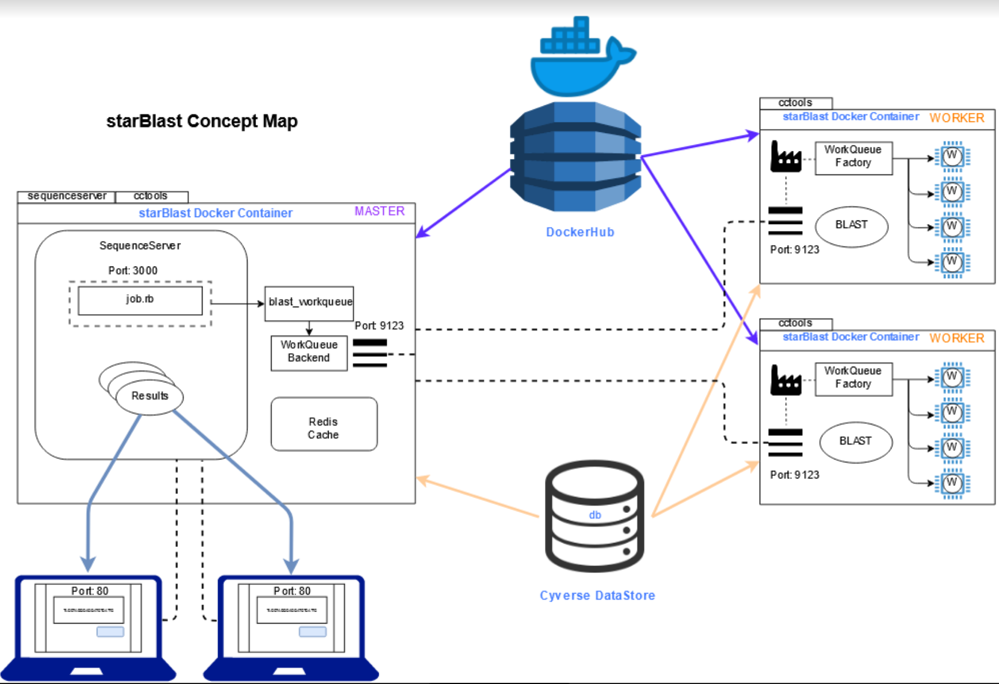
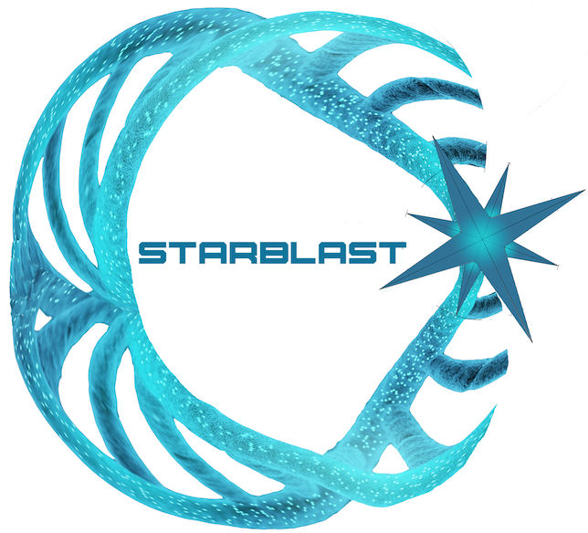
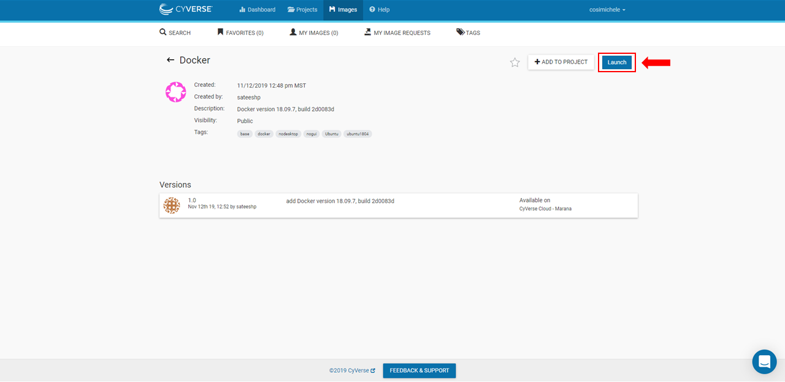

|starblast_logo|_

StarBLAST
=========

StarBLAST is a project undertaken by under-graduate and graduate students taking the "Applied Concepts in Cyberinfrastructure" course, 2019 at University of Arizona taught by Dr. Nirav Merchant and Dr. Eric Lyons. Students at the University of Arizona have created a 

.. contents::

What is StarBLAST?
------------------

StarBlast is a scalable extension of the open source Sequenceserver BLAST, with the goal of making BLAST more accessible to educators and researchers who want to run classroom-scale searches concurrently. StarBLAST is distributed scaling of BLAST using `Sequenceserver <http://sequenceserver.com/>`_, `cctools <http://ccl.cse.nd.edu/>`_ and `CyVerse's Visual Interactive Computing Enviornment (VICE) <https://learning.cyverse.org/projects/vice/en/latest/getting_started/about.html/>`_. 

In 2015 a modern front-end implementation of BLAST, Sequenceserver, was developed by the Wurmlab at Queen Mary University of London (Priyam et al., 2015). Sequenceserver provides various advantages over the NCBI BLAST implementation, such as an improved GUI to visualize BLAST results, the use of custom databases, and the ability to download results in various formats for further analysis. Read about Sequenceserver's user-centric design and sustainable software development philosophy `here <https://doi.org/10.1093/molbev/msz185>`_. Despite being a state-of-the-art BLAST service, the current Sequenceserver implementation is not easily scalable, especially for classes without IT support or classes with hundreds of students.

StarBLAST extends Sequenceserver’s BLAST implementation with the `Work Queue <https://cctools.readthedocs.io/en/latest/work_queue/>`_ job management system and `VICE <https://learning.cyverse.org/projects/vice/en/latest/getting_started/about.html/>`_ to distribute work amongst multiple machines. By providing distributed and scalable BLAST capabilities, StarBLAST enables researchers and instructors to run many BLAST jobs simultaneously using large computational resources. StarBLAST consists of three distinct BLAST implementations that users can select based on their technical expertise, the number of users who want to submit concurrent jobs, and external computational resource availability.

1. Sequenceserver-VICE: the primer solution to BLAST limitations
~~~~~~~~~~~~~~~~~~~~~~~~~~~~~~~~~~~~~~~~~~~~~~~~~~~~~~~~~~~~~~

Sequenceserver-VICE is a Visual and Interactive Computing Environment in CyVerse’s Discovery Environment (DE) for running interactive apps such as Sequenceserver. 

2. StarBLAST-Dockers: A secondary, intermediate solution
~~~~~~~~~~~~~~~~~~~~~~~~~~~~~~~~~~~~~~~~~~~~~~~~~~~~~~~

StarBLAST-Docker containers can be deployed on any cloud such as Atmosphere for distributed scaling of BLAST searches.

3. StarBLAST-HPC: A robust, tertiary solution
~~~~~~~~~~~~~~~~~~~~~~~~~~~~~~~~~~~~~~~~~~~

StarBLAST-HPC is a solution to distribute large number of queries on a High Performance Computer.

Platform(s)
-----------

*We will use the following CyVerse platform(s):*

.. list-table::
    :header-rows: 1

    * - Solution
      - Platform
      - Capacity
      - Link
      - Platform Documentation
      - Learning Center Docs
    * - StarBLAST-VICE
      - Discovery Environment
      - 5-25 Students
      - `Discovery Environment <https://de.cyverse.org/de/>`_
      - `DE Manual <https://wiki.cyverse.org/wiki/display/DEmanual/Table+of+Contents>`_
      - `Guide <https://learning.cyverse.org/projects/discovery-environment-guide/en/latest/>`__
    * - StarBLAST-Dockers on Atmosphere Cloud
      - Atmosphere Cloud / Docker
      - 25-50 Students
      - `Atmosphere <https://atmo.cyverse.org/de/>`_
      - `Atmosphere Manual <https://wiki.cyverse.org/wiki/display/DEmanual/Table+of+Contents>`_
      - `Guide <https://learning.cyverse.org/projects/atmosphere-guide/en/latest/>`__
    * - StarBLAST-HPC
      - HPC & Atmosphere Cloud
      - 50+ Students
      - `cctools <https:://github.com/cooperative-computing-lab/>`_
      - `PBS on HPC  <https://public.confluence.arizona.edu/display/UAHPC>`_
      - `Workqueue <https://cctools.readthedocs.io/en/latest/work_queue/>`__

----

Sequenceserver-VICE Setup
-------------------------

Sequenceserver-VICE is a Visual and Interactive Computing Environment app in CyVerse’s Discovery Environment (DE) for running interactive apps such as SequenceServer. 

.. note::

   Requires access to Cyverse `Discovery Environment <https://de.cyverse.org/de/>`_

Quick Launch
~~~~~~~~~~~~

1. Click on the following button to quick-launch SequenceServer in CyVerse Discovery Environment with two blast databases (Human_GRCh38_p12 & Mouse_GRCm38_p4).

	|sequenceServer|_
	
2. Click [Launch Analysis]
3. Check the notifications Bell Icon for a link to access your SequenceServer instance.
4. Click `here <https://www.ncbi.nlm.nih.gov/nuccore/NG_007114.1?from=4986&to=6416&report=fasta>`_ for a sample DNA sequence to test the sequence similarity of the query fragment with random human and mouse sequences.
5. Paste the query sequence and select both the available databases and submit job.

.. note::
   To set up your own custom database on the VICE platform, see the appendix section.

----

StarBLAST-Dockers on Atmosphere Cloud
-------------------------------------

To deploy StarBLAST setup on CyVerse Atmosphere cloud, you will need access to `Atmosphere <https://atmo.cyverse.org/application/images>`_. Request access to Atmosphere from your `CyVerse user account <https://user.cyverse.org>`_.

.. note::
   The StarBlast implementation consists of one Master instance that will serve as the front-end for all users and one or more Worker instances that connect to the master and execute the BLAST jobs.

You will need to launch a Master instance that will host sequenceServer front-end and one or more Worker instances as needed to distribute the blast jobs. 

Both the Master and Worker Virtual Machine instances use Docker containers to run sequenceServer and connect Workers. 

Launching Master & Worker Instances
~~~~~~~~~~~~~~~~~~~~~~~~~~~~~~~~~~~

1. Login to `Atmosphere <https://atmo.cyverse.org/application/images>`_ where we will be setting up Master and Worker instances that are to be launched using the following respective deployment scripts. These deployment scripts (Master & Worker) are designed to:
	+ download specified blast databases
	+ Master script to launch sequenceServer front-end that can be accessed using the IP ADDRESS of the instance. 
	+ Worker script to connect factory of workers to the Master

2. The deployment scripts for a Master instance (atmo_deploy_master.sh) can be found `here <https://raw.githubusercontent.com/zhxu73/sequenceserver-scale-docker/cd4eeb52d1dcdbcd2b0c983bc34893212db0428c/deploy/atmo_deploy_master.sh>`_. 

3. The deployment scripts for a Worker instance (atmo_deploy_worker.sh) can be found `here <https://raw.githubusercontent.com/zhxu73/sequenceserver-scale-docker/cd4eeb52d1dcdbcd2b0c983bc34893212db0428c/deploy/atmo_deploy_worker.sh>`_.

.. note::
   Users can specify the blast databases to be downloaded in the deployment scripts 

4. Launching Master instance with deployment script
  
- From `Atmosphere <https://atmo.cyverse.org/application/images>`_ dashboard, select “Launch New Instance”

|Tut_1|_
  
- Search for “Docker” and select the “Docker” image here highlighted (or click `here <https://atmo.cyverse.org/application/images/1759>`_); click “Launch”

|Tut_2|_

|Tut_3|_ 

- In the pop up menu you can customize your image (e.g. Instance Size. recommend a minimum of medium m1 instance for Master); select “Advanced Options”

|Tut_4|_

-  Select “Create a New Script” 

|Tut_5|_

-  Choose a title for your script; Select “Raw Text” and copy and paste text from either the Master (if creating the Master virtual machine) or Worker (if creating the Worker virtual machine) deployment scripts linked above. Select “Save and Add Script”.

.. note::
   This step is required to be done **once** for both the Master and Worker virtual machines. The deployment scripts are stored in user's advanced settings and will be available readily for future use.
 
|Tut_6|_

-  Select “Continue to Launch”

|Tut_7|_

5. Launch one ore more Worker instance(s) with a deployment script (atmo_deploy_worker.sh) as per the steps above.

.. note::
   Atmosphere will take around 5-10 minutes to set up and activate your customized virtual machines and the wait-time will increase with the size of the blast database.
  
Start Blasting
~~~~~~~~~~~~~~

Now, anyone can open a web-browser and go to <MASTER_VM_IP_ADDRESS> to access sequence-Server front-end and start BLASTING!

.. code::

   <MASTER_VM_IP_ADDRESS>

----

StarBLAST-HPC Setup
-------------------

The StarBLAST-HPC Setup is ideal for distributing BLAST searches across multiple nodes on a High-Performance Computer.

In order to achieve a successful setup of the StarBLAST HPC system, a small amount of command line knowledge is required.

Similar to the StarBLAST-Dockers on Atmosphere cloud, the StarBLAST-HPC system also has a Master-Worker set-up: a dockerized atmosphere VM machine acts as the Master, and the HPC acts as the Worker. It is suggested that the Worker is set up well ahead of time.

Setting Up the Worker HPC
~~~~~~~~~~~~~~~~~~~~~~~~

It is important that the following software are installed on the HPC:

- glibc version 2.14 or newer, 

- ncbi-blast+ version 2.6.0 or newer (ftp://ftp.ncbi.nlm.nih.gov/blast/executables/blast+/LATEST/ncbi-blast-2.9.0+-src.tar.gz)

- CCTools (cctools-7.0.21-x86_64-centos7.tar.gz)

Put both ncbi-blast+ and CCTools in your home directory.
Databases need to be downloaded in a personal directory in the home folder.

.. code::

   /home/<U_NUMBER>/<USER>/Database
   
The HPC uses a .pbs and qsub system to submit jobs.

Create a .pbs file that contains the following code and change the <VARIABLES> to preferred options:

.. code::

   #!/bin/bash
   #PBS -W group_list=<GROUP_NAME>
   #PBS -q <QUEUE_TYPE>
   #PBS -l select=<NUMBER_OF_NODES>:ncpus=<NUMBER_OF_CPUS_PER_NODE>:mem=<NUMBER_OF_RAM_PER_NODE>gb
   #PBS -l place=pack:shared
   #PBS -l walltime=<WALLTIME_REQUIRED>
   #PBS -l cput=<WALLTIME_REQUIRED>
   module load unsupported
   module load ferng/glibc
   export CCTOOLS_HOME=/home/<U_NUMBER>/<USER>/cctools-7.0.19-x86_64-centos7
   export PATH=${CCTOOLS_HOME}/bin:$PATH
   export PATH=$PATH:/home/<U_NUMBER>/<USER>/ncbi-blast-2.9.0+/bin
   /home/<U_NUMBER>/<USER>/cctools-7.0.19-x86_64-centos7/bin/work_queue_factory -M StarBLAST -T local -w <NUMBER_OF_WORKERS>

An example of a .pbs file running on the University of Arizona HPC:

.. code::

   #!/bin/bash
   #PBS -W group_list=ericlyons
   #PBS -q windfall
   #PBS -l select=2:ncpus=6:mem=24gb
   #PBS -l place=pack:shared
   #PBS -l walltime=02:00:00
   #PBS -l cput=02:00:00
   module load unsupported
   module load ferng/glibc
   module load blast
   export CCTOOLS_HOME=/home/u12/cosi/cctools-7.0.19-x86_64-centos7
   export PATH=${CCTOOLS_HOME}/bin:$PATH
   cd /home/u12/cosi/cosi-workers
   /home/u12/cosi/cctools-7.0.19-x86_64-centos7/bin/work_queue_factory -M StarBLAST -T local -w 2

In the example above, the user already has blast installed (calls it using “module load blast“). The script will submit to the HPC nodes a total of 2 workers.

Submit the .pbs script with 

.. code::
    
   qsub <NAME_OF_PBS>.pbs
   
Setting Up Master Docker
~~~~~~~~~~~~~~~~~~~~~~~~

Copy and paste the following code in the Master instance to launch sequenceServer with two databases (Human_GRCh38_p12 & Mouse_GRCm38_p4) ready to distribute BLAST queries to workers

IMPORTANT: THE PATH TO THE DATABASE ON THE MASTER NEED TO BE THE SAME AS THE ONE ON THE WORKER

.. code:: 

   docker run --rm -ti -p 80:3000 -p 9123:9123 -e PROJECT_NAME=StarBLAST = -e BLAST_NUM_THREADS=4 -e SEQSERVER_DB_PATH=/home/<U_NUMBER>/<USER>/Database zhxu73/sequenceserver-scale
   
An example is:

.. code:: 

   docker run --rm -ti -p 80:3000 -p 9123:9123 -e PROJECT_NAME=StarBLAST = -e BLAST_NUM_THREADS=4 -e SEQSERVER_DB_PATH=/home/u12/cosi/Data zhxu73/sequenceserver-scale
   
In case the user does not have access to iRODS please use:

.. code::

   docker run --rm -ti -p 80:3000 -p 9123:9123 -e PROJECT_NAME=StarBLAST -e WORKQUEUE_PASSWORD= -e BLAST_NUM_THREADS=4 -e /home/<U_NUMBER>/<USER>/Database -v $HOME/blastdb:/<U_NUMBER>/<USER>/Database zhxu73/sequenceserver-scale:no-irods
   
.. note::

   The custom Database folder on the Master needs to have read and write permissions
Start BLASTING! Enter the <MASTER_VM_IP_ADDRESS> in your browser using the actual Master IP address.

.. code::

   <MASTER_VM_IP_ADDRESS>
   
----

Appendix
--------

Sequenceserver-VICE Using Custom Databases
~~~~~~~~~~~~~~~~~~~~~~~~~~~~~~~~~~~~~~~~~~

See documentation and a demo tutorial on launching the Sequenceserver VICE app with custom databases `here <https://cyverse-sequenceserver.readthedocs-hosted.com/en/latest/>`_.

StarBLAST concept map
~~~~~~~~~~~~~~~~~~~~~

|concept_map|_

StarBLAST-Atmosphere Using iRods for Custom Databases
~~~~~~~~~~~~~~~~~~~~~~~~~~~~~~~~~~~~~~~~~~~~~~~~~~~~~

Set the PATH to custom databases on CyVerse Data Store by using the custom IRODS_SYNC_PATH variable 

.. code:: 
   
   -e IRODS_SYNC_PATH=/PATH/TO/Databases

StarBLAST-Docker on any Cloud Using Custom Databases
~~~~~~~~~~~~~~~~~~~~~~~~~~~~~~~~~~~~~~~~~~~~~~~~~~~~

StarBLAST (no-irods) docker containers can be run on any cloud platform/s you have access to by supplying the local path to blast databases as follows:

Master/Web Docker

.. code::
   
   docker run -ti -p 80:3000 -p 9123:9123 -e PROJECT_NAME=StarBLAST -e WORKQUEUE_PASSWORD= -e BLAST_NUM_THREADS=4 --volume=/local_db_path:/var/www/sequenceserver/db zhxu73/sequenceserver-scale:no-irods

Worker Docker

.. code::

   docker run -ti --net=host -e PROJECT_NAME=StarBLAST -e WORKQUEUE_PASSWORD= -e BLAST_NUM_THREADS=4 -e NUM_WORKER=2 --volume=/local_db_path:/var/www/sequenceserver/db zhxu73/sequenceserver-scale-worker:no-irods
   
.. note::

   Here are some links to private and public cloud service providers:
   
   `XSEDE Jetstream <https://use.jetstream-cloud.org/application/images>`_
   
   `Digital Ocean Cloud <https://www.digitalocean.com/>`_. See more documentation `here <DO.rst>`_.
   
   `Google Cloud Platform <https://cloud.google.com/>`_

Making Custom Databases using ncbi_blast_docker
~~~~~~~~~~~~~~~~~~~~~~~~~~~~~~~~~~~~~~~~~~~~~~~~

	+ Read more here at `ncbi docker wiki <https://github.com/ncbi/docker/wiki/Getting-BLAST-databases>`_

----

Acknowledgements
~~~~~~~~~~~~~~~~

Priyam A, Woodcroft BJ, Rai V, Munagala A, Moghul I, Ter F, Gibbins MA, Moon H, Leonard G, Rumpf W & Wurm Y. 2015. Sequenceserver: a modern graphical user interface for custom BLAST databases. biorxiv doi: 10.1101/033142.

----

**Fix or improve this documentation**

- On Github: `Repo link <https://github.com/uacic/StarBlast>`_
- Send feedback: `Maintainer@StarBLAST <sateeshp@email.arizona.edu>`_

----

.. |sequenceServer| image:: https://de.cyverse.org/Powered-By-CyVerse-blue.svg
.. _sequenceServer: https://de.cyverse.org/de/?type=quick-launch&quick-launch-id=0ade6455-4876-49cc-9b37-a29129d9558a&app-id=ab404686-ff20-11e9-a09c-008cfa5ae621

.. _concept_map: http://learning.cyverse.org/

.. |CyVerse logo| image:: ./img/cyverse_rgb.png
    :width: 500
    :height: 100
.. _CyVerse logo: http://learning.cyverse.org/
.. |Home_Icon| image:: ./img/homeicon.png
    :width: 25
    :height: 25
.. _Home_Icon: http://learning.cyverse.org/

.. _starblast_logo:   
.. |discovery_enviornment| raw:: html
.. |Tut_1| image:: ./img/Tut_06.PNG
    :width: 650
    :height: 450
.. _Tut_1: http://learning.cyverse.org/
.. |Tut_2| image:: ./img/Tut_07.PNG
    :width: 650
    :height: 450
.. _Tut_2: http://learning.cyverse.org/

.. _Tut_3: http://learning.cyverse.org/
.. |Tut_4| image:: ./img/Tut_09.PNG
    :width: 650
    :height: 450
.. _Tut_4: http://learning.cyverse.org/
.. |Tut_5| image:: ./img/Tut_10.PNG
    :width: 650
    :height: 450
.. _Tut_5: http://learning.cyverse.org/
.. |Tut_6| image:: ./img/Tut_11.PNG
    :width: 650
    :height: 450
.. _Tut_6: http://learning.cyverse.org/
.. |Tut_7| image:: ./img/Tut_12.PNG
    :width: 650
    :height: 450
.. _Tut_7: http://learning.cyverse.org/
    <a href="https://de.cyverse.org/de/" target="_blank">Discovery Environment</a>
    
